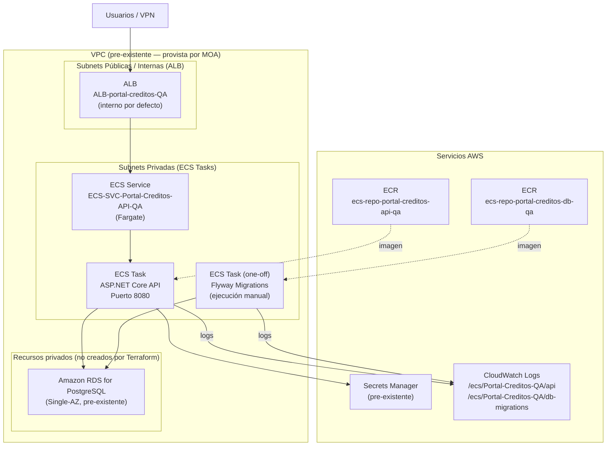
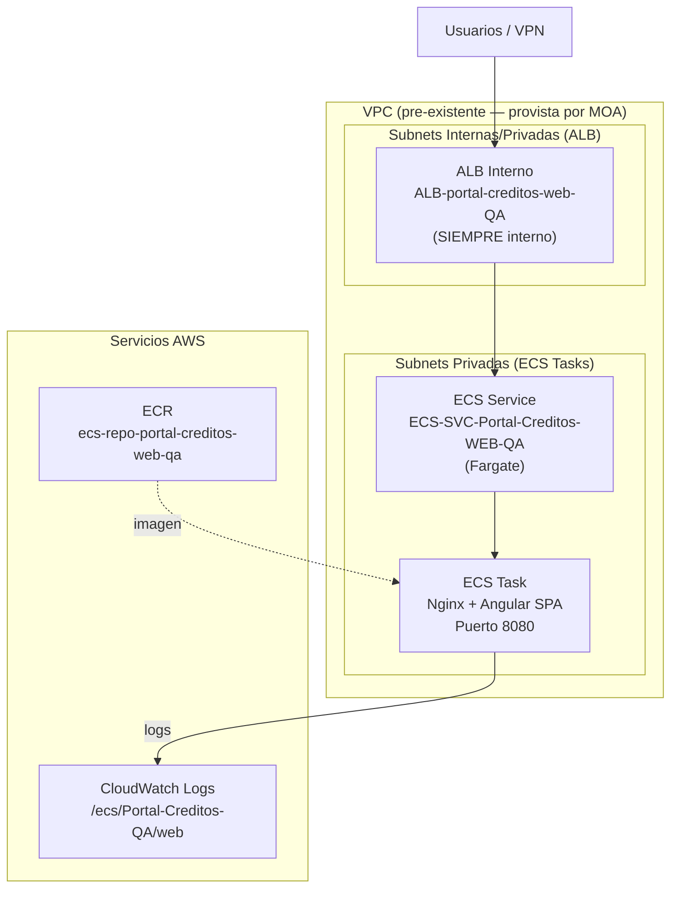
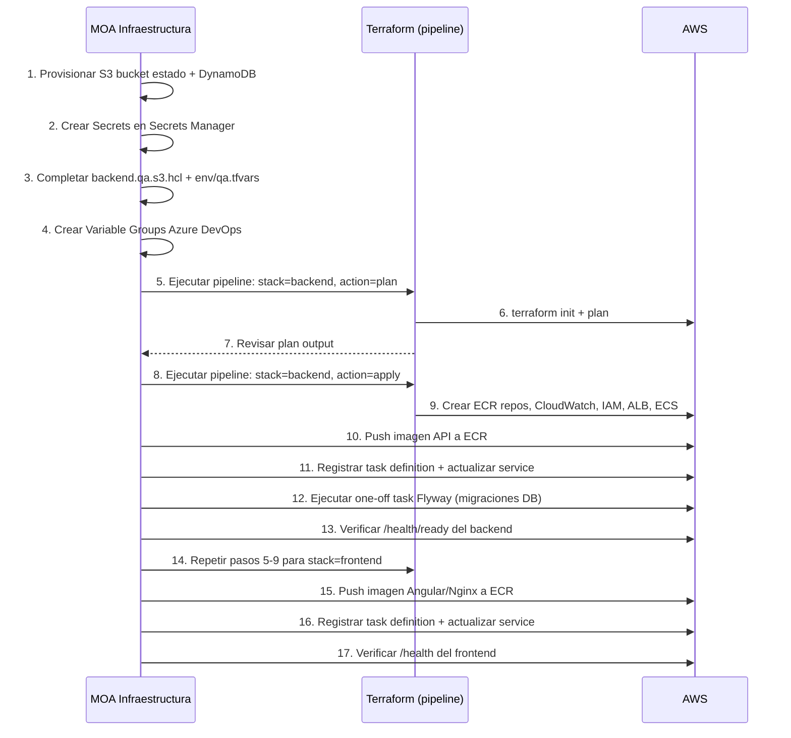
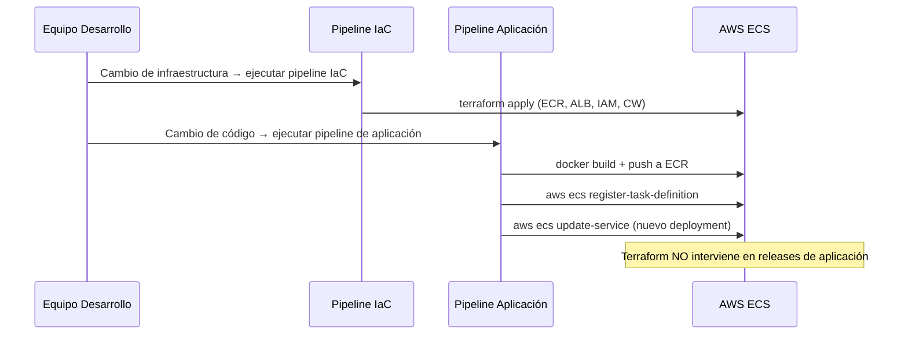

# 01 — Arquitectura de Infraestructura
## Portal Creditos — AWS ECS Fargate

| | |
|---|---|
| **Proyecto** | Portal Creditos |
| **Proveedor Cloud** | Amazon Web Services (AWS) |
| **Región** | us-east-1 |
| **Compute** | Amazon ECS Fargate |
| **IaC** | Terraform >= 1.10, < 2.0 |
| **Estándar** | MOA-INFRA-Terraform-Best-Practices v1.3 |

---

## 1. Visión General

Portal Creditos está compuesto por dos servicios desacoplados:

| Servicio | Stack Terraform | Tecnología | Descripción |
|---|---|---|---|
| **Backend API** | `infra/terraform/backend/` | ASP.NET Core + Flyway | API REST + migraciones de base de datos PostgreSQL |
| **Frontend Web** | `infra/terraform/frontend/` | Angular + Nginx | SPA Angular servida por Nginx |

Cada servicio tiene su propio stack Terraform independiente con:
- Estado remoto separado
- Ciclo de vida independiente
- Pipeline ejecutable por separado

### Flujo de acceso completo

```
VPN / Red Corporativa
         ↓
 Internal Application Load Balancer (ALB)
         ↓
         ├──► Frontend Angular (Amazon ECS Fargate / Nginx)
         │
         └──► Backend .NET (Amazon ECS Fargate / ASP.NET Core)
                  ↓
         Amazon RDS for PostgreSQL (Single-AZ)
         [pre-existente — no creada por Terraform]
```

> **Nota sobre la base de datos:** La solución no aprovisiona la instancia de base de datos.
> Amazon ECS inyecta las credenciales como variable de entorno `ConnectionStrings__PostgresConnection`
> desde un Secret de AWS Secrets Manager administrado por MOA.
> Ver `docs/02-Deployment-Inputs.md` Sección D para el contrato de acceso completo.

---

## 2. Arquitectura Backend

### 2.1 Diagrama de arquitectura



### 2.2 Recursos creados por Terraform — Backend

| Recurso AWS | Nombre (ejemplo QA) | Módulo |
|---|---|---|
| `aws_ecr_repository` (API) | `ecs-repo-portal-creditos-api-qa` | `modules/ecr` |
| `aws_ecr_repository` (Flyway) | `ecs-repo-portal-creditos-db-qa` | `modules/ecr` |
| `aws_ecr_lifecycle_policy` (x2) | — | `modules/ecr` |
| `aws_cloudwatch_log_group` (API) | `/ecs/Portal-Creditos-QA/api` | `modules/monitoring` |
| `aws_cloudwatch_log_group` (Flyway) | `/ecs/Portal-Creditos-QA/db-migrations` | `modules/monitoring` |
| `aws_iam_role` (execution) | `ROLE-ECS-Portal-Creditos-API-QA-EXECUTION` | `modules/iam` |
| `aws_iam_role` (task) | `ROLE-ECS-Portal-Creditos-API-QA-TASK` | `modules/iam` |
| `aws_iam_role_policy_attachment` | `AmazonECSTaskExecutionRolePolicy` | `modules/iam` |
| `aws_iam_role_policy` (secrets, opcional) | `POL-ECS-Portal-Creditos-API-QA-SECRETS` | `modules/iam` |
| `aws_security_group` (ALB) | `SG_MOA_ECS_QA_Portal-Creditos-ALB` | `modules/networking` |
| `aws_security_group` (service) | `SG_MOA_ECS_QA_Portal-Creditos-API` | `modules/networking` |
| `aws_lb` | `ALB-portal-creditos-QA` | `modules/networking` |
| `aws_lb_target_group` | `ALB-TG-portal-creditos-QA` | `modules/networking` |
| `aws_lb_listener` (HTTP/HTTPS) | — | `modules/networking` |
| `aws_ecs_cluster` | `ECS-CLT-Portal-Creditos-API-QA` | `modules/ecs` |
| `aws_ecs_task_definition` (API) | `ECS-TASK-DEF-Portal-Creditos-API-QA` | `modules/ecs` |
| `aws_ecs_task_definition` (Flyway) | `ECS-TASK-DEF-Portal-Creditos-API-QA-DB` | `modules/ecs` |
| `aws_ecs_service` | `ECS-SVC-Portal-Creditos-API-QA` | `modules/ecs` |
| `aws_appautoscaling_target` (condicional) | — | `modules/ecs` |
| `aws_appautoscaling_policy` (condicional) | `AAS-Portal-Creditos-API-QA-CPU` | `modules/ecs` |

**Total: 20 recursos gestionados por Terraform** (algunos condicionales)

### 2.3 Recursos NO creados por Terraform — Backend

| Recurso | Motivo | Responsable |
|---|---|---|
| VPC | Pre-existente en la cuenta AWS de MOA | MOA Infraestructura |
| Subnets | Pre-existentes en la cuenta AWS de MOA | MOA Infraestructura |
| Amazon RDS for PostgreSQL (Single-AZ) | Pre-existente. La aplicación .NET consume la DB a través de la cadena de conexión inyectada por ECS desde AWS Secrets Manager. | MOA / Equipo DB |
| Secrets Manager (secretos) | Propiedad y gestión de MOA Seguridad | MOA Seguridad |
| Route53 / DNS | Gestión centralizada MOA | MOA Networking |
| ACM Certificate | Gestión centralizada MOA | MOA Seguridad |
| S3 Bucket (estado Terraform) | Infraestructura corporativa MOA | MOA Infraestructura |
| DynamoDB (state lock) | Infraestructura corporativa MOA | MOA Infraestructura |
| KMS Key (logs) | Gestión centralizada MOA Seguridad | MOA Seguridad |
| S3 Bucket (ALB logs) | Infraestructura corporativa MOA | MOA Infraestructura |

---

## 3. Arquitectura Frontend

### 3.1 Diagrama de arquitectura



### 3.2 Recursos creados por Terraform — Frontend

| Recurso AWS | Nombre (ejemplo QA) | Módulo |
|---|---|---|
| `aws_ecr_repository` | `ecs-repo-portal-creditos-web-qa` | `modules/ecr` |
| `aws_ecr_lifecycle_policy` | — | `modules/ecr` |
| `aws_cloudwatch_log_group` | `/ecs/Portal-Creditos-QA/web` | `modules/monitoring` |
| `aws_iam_role` (execution) | `ROLE-ECS-Portal-Creditos-WEB-QA-EXECUTION` | `modules/iam` |
| `aws_iam_role` (task) | `ROLE-ECS-Portal-Creditos-WEB-QA-TASK` | `modules/iam` |
| `aws_iam_role_policy_attachment` | `AmazonECSTaskExecutionRolePolicy` | `modules/iam` |
| `aws_security_group` (ALB) | `SG_MOA_ECS_QA_Portal-Creditos-WEB-ALB` | `modules/networking` |
| `aws_security_group` (service) | `SG_MOA_ECS_QA_Portal-Creditos-WEB-SVC` | `modules/networking` |
| `aws_lb` | `ALB-portal-creditos-web-QA` | `modules/networking` |
| `aws_lb_target_group` | `ALB-TG-portal-creditos-web-QA` | `modules/networking` |
| `aws_lb_listener` (HTTP/HTTPS) | — | `modules/networking` |
| `aws_ecs_cluster` | `ECS-CLT-Portal-Creditos-WEB-QA` | `modules/ecs` |
| `aws_ecs_task_definition` | `ECS-TASK-DEF-Portal-Creditos-WEB-QA` | `modules/ecs` |
| `aws_ecs_service` | `ECS-SVC-Portal-Creditos-WEB-QA` | `modules/ecs` |
| `aws_appautoscaling_target` (condicional) | — | `modules/ecs` |
| `aws_appautoscaling_policy` (condicional) | `AAS-Portal-Creditos-WEB-QA-CPU` | `modules/ecs` |

**Total: 16 recursos gestionados por Terraform** (algunos condicionales)

---

## 4. Flujo de despliegue

### 4.1 Primer despliegue



### 4.2 Ciclo de vida post-despliegue



---

## 5. Dependencias externas

| Recurso | Tipo | Responsable | Variable Terraform |
|---|---|---|---|
| VPC | Pre-existente | MOA Networking | `var.vpc_id` |
| Subnets públicas/internas (Backend ALB) | Pre-existentes | MOA Networking | `var.public_subnet_ids` |
| Subnets privadas (Backend ECS) | Pre-existentes | MOA Networking | `var.private_subnet_ids` |
| Subnets ALB Frontend | Pre-existentes | MOA Networking | `var.load_balancer_subnet_ids` |
| Subnets privadas (Frontend ECS) | Pre-existentes | MOA Networking | `var.private_subnet_ids` |
| Amazon RDS for PostgreSQL (Single-AZ) | Pre-existente | MOA / DB | Via secret ARN |
| Secrets Manager — 5 secretos backend | Pre-existentes | MOA Seguridad | `*_secret_arn` variables |
| ACM Certificate (HTTPS obligatorio) | Pre-existente | MOA Seguridad | `var.certificate_arn` |
| S3 Bucket estado Terraform | Pre-existente | MOA Infraestructura | `backend.*.hcl` |
| S3 native state lockfile | Pre-existente | MOA Infraestructura | `use_lockfile = true` |
| KMS Key (logs, opcional) | Pre-existente | MOA Seguridad | `var.log_kms_key_arn` |
| S3 ALB Access Logs (opcional) | Pre-existente | MOA Infraestructura | `var.alb_access_logs_bucket` |
| Azure DevOps (pipeline) | Plataforma CI/CD | MOA DevOps | Variable Groups |
| AWS Service Connection OIDC | Autenticación AWS federada | MOA DevOps | Parámetro `awsServiceConnection` |
